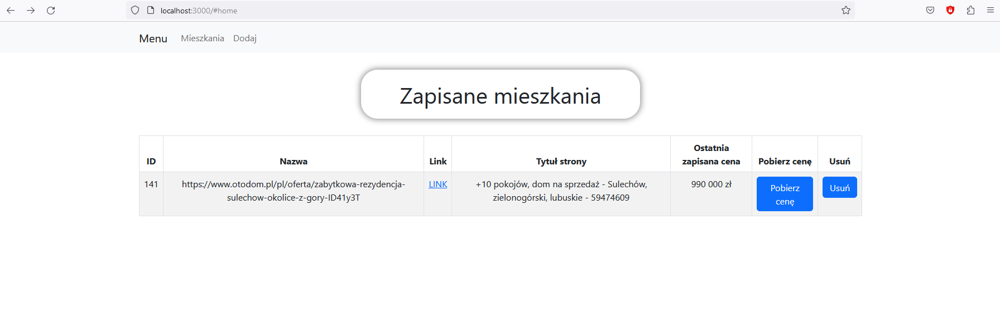
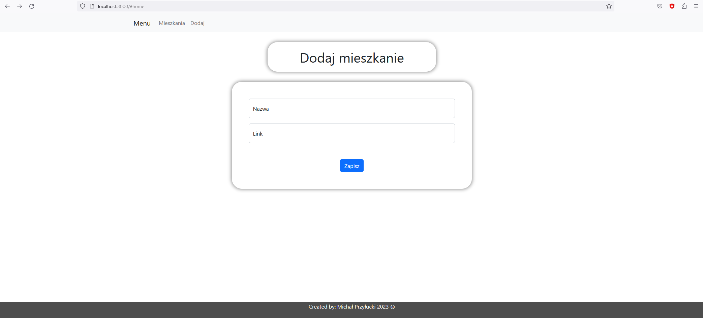

# Property Prices Tracker
## Quick description
Small application designed to allow user to track property prices on **otodom.pl**.
All you have to do is add new record with valid link from website. Then click "Pobierz cenę" and application will get that price from actual website.

## Features
🏠 Property Prices Tracker is a web application built using Django, TypeScript, and React that allows users to track and save property prices from the popular real estate website **Otodom.pl**.

📈 Users can easily add new properties by entering the link to the property on Otodom.pl, and the application will automatically fetch the current price and save it to the database.

🗃️ All saved records can be viewed and managed from the application's dashboard, which provides a clear overview of the properties and their prices.

🚀 Property Prices Tracker is a great tool for anyone interested in keeping track of property prices in their local market or for those who are actively looking for properties to buy or rent.

# How to start


To get started with Property Prices Tracker, clone this repository and follow the instructions below:

## frontend
1. Install the required dependencies by running the following command:

```
npm install
```

2. Start the development server by running the following command:
```
npm start
```
3. Open the application in your browser by navigating to http://localhost:3000.

## backend
1. Install required packages:
```
pip install django
pip install djangorestframework
```
2. Create DB and run migrations
```
python manage.py migrate
```

3. Start development serwer:
```
python manage.py runserver
```

# Technologies Used

- Python: Django
- TypeScript: React

# Screenshots

## Dashboard screenshot



---
## Adding property screenshot



👉 Please note that this application is for demonstration purposes only and should not be used to track actual property prices.